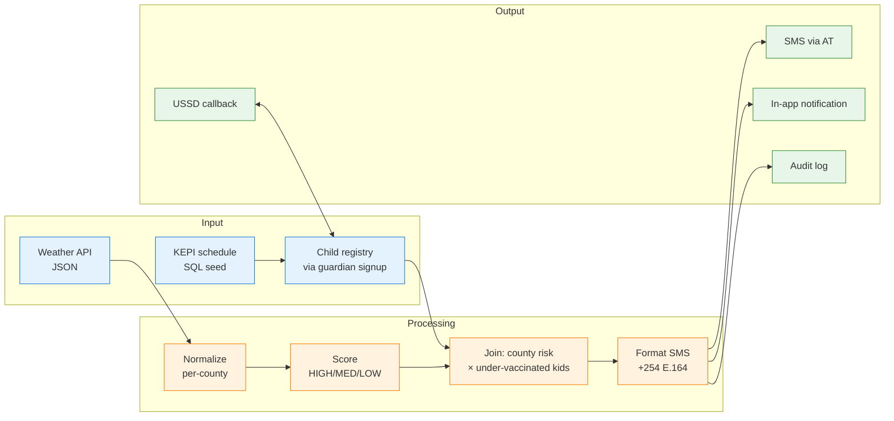

# Data Flow

How a single record moves through the system, from weather forecast to parent's phone.



## Data contracts

### Climate ingest output (one record per county)
```json
{
  "county": "Kisumu",
  "peak_rainfall_mm": 74.0,
  "avg_temp_max_c": 28.1,
  "risk_scores": {
    "cholera":    "HIGH",
    "malaria":    "HIGH",
    "pneumonia":  "LOW",
    "meningitis": "LOW"
  },
  "scored_at": "2026-05-14T08:00:00+03:00"
}
```

### Tracker query (children at risk in HIGH county)
```sql
SELECT c.child_id, c.name, c.health_id,
       u.name AS guardian_name, u.phone AS guardian_phone,
       COUNT(vs.schedule_id) AS missed_doses
FROM children c
JOIN users u ON c.guardian_id = u.user_id
JOIN vaccination_schedule vs ON vs.child_id = c.child_id
WHERE u.location = 'Kisumu'
  AND vs.status IN ('Missed', 'Pending')
GROUP BY c.child_id
HAVING missed_doses > 0;
```

### SMS payload (Africa's Talking)
```json
{
  "to": "+254733000004",
  "from": "Jarida",
  "message": "🚨 High cholera risk in Kisumu (next 7-14 days). Your child Zuri has 8 missed doses. Visit Kisumu County Hospital. — ClimateShield AI"
}
```
