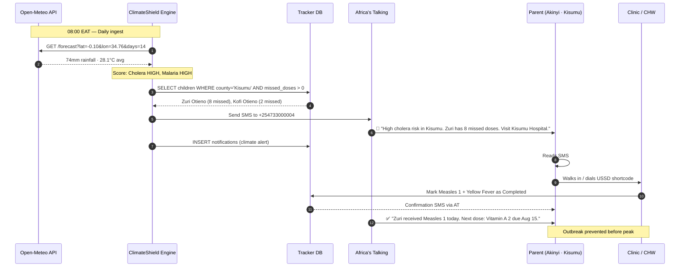

# Parent Alert Journey

What happens, step by step, when ClimateShield AI detects an outbreak risk in a parent's county.

## Timeline reality check

| Step | Latency in pilot |
|---|---|
| Climate ingest → risk score | < 5 seconds per county |
| Risk score → SMS dispatched | < 8 seconds (sandbox) |
| SMS read → clinic visit | Same day to 7 days (parent decision) |
| Forecast window for action | 7–14 days before predicted outbreak peak |
