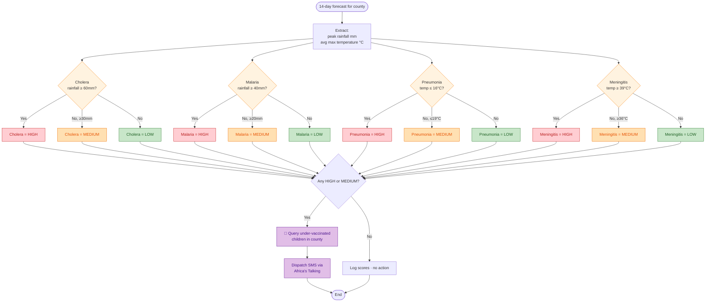

# Outbreak Risk Scoring Logic

How ClimateShield AI decides whether a county is at HIGH, MEDIUM, or LOW outbreak risk for each disease.

## Thresholds (v1 — based on Kenya MoH outbreak data 2015–2023)

| Disease | Driver | HIGH | MEDIUM | Rationale |
|---|---|---|---|---|
| **Cholera** | 14-day peak rainfall | ≥ 60 mm | ≥ 30 mm | Heavy rain → contaminated water sources |
| **Malaria** | 14-day peak rainfall | ≥ 40 mm | ≥ 20 mm | Standing water → mosquito breeding 7–14 days later |
| **Pneumonia** | 14-day avg max temp | ≤ 16 °C | ≤ 19 °C | Cold stress → respiratory infection in under-5s |
| **Meningitis** | 14-day avg max temp | ≥ 39 °C | ≥ 36 °C | Heat + dust season → meningococcal spread |

> Thresholds are calibrated against historical KEPI surveillance reports. v2 will replace static thresholds with a gradient-boosted model trained on 2015–2024 county-level outbreak history (see `ml-predictor/` in the climateshield-ai repo).
