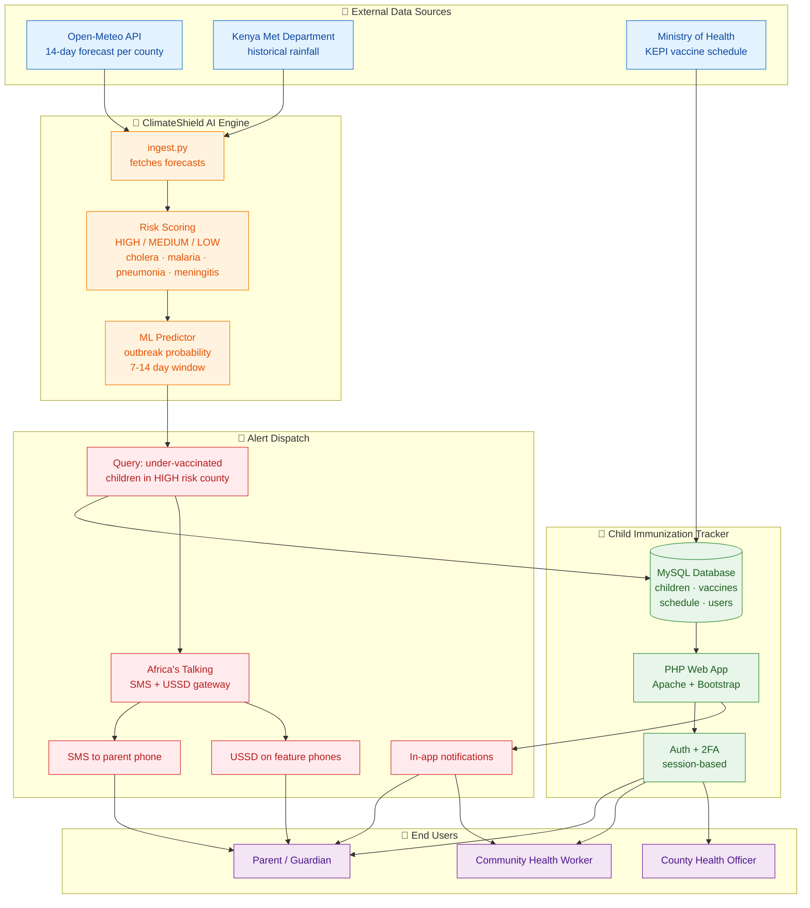

# ClimateShield AI — System Architecture

End-to-end view of how climate data, the immunization tracker, and the alert pipeline connect.

## Key flows

1. **Daily ingest** — `ingest.py` runs on cron, fetches 14-day forecasts for all 47 counties.
2. **Risk scoring** — peak rainfall and average temperature mapped to three-tier risk per disease.
3. **Cross-reference** — when a county hits HIGH/MEDIUM, query the tracker for under-vaccinated children there.
4. **Dispatch** — Africa's Talking sends SMS (smartphone or feature phone) and the in-app notification fires.
5. **Parent action** — parent visits clinic; healthcare worker marks dose completed; status syncs back.
